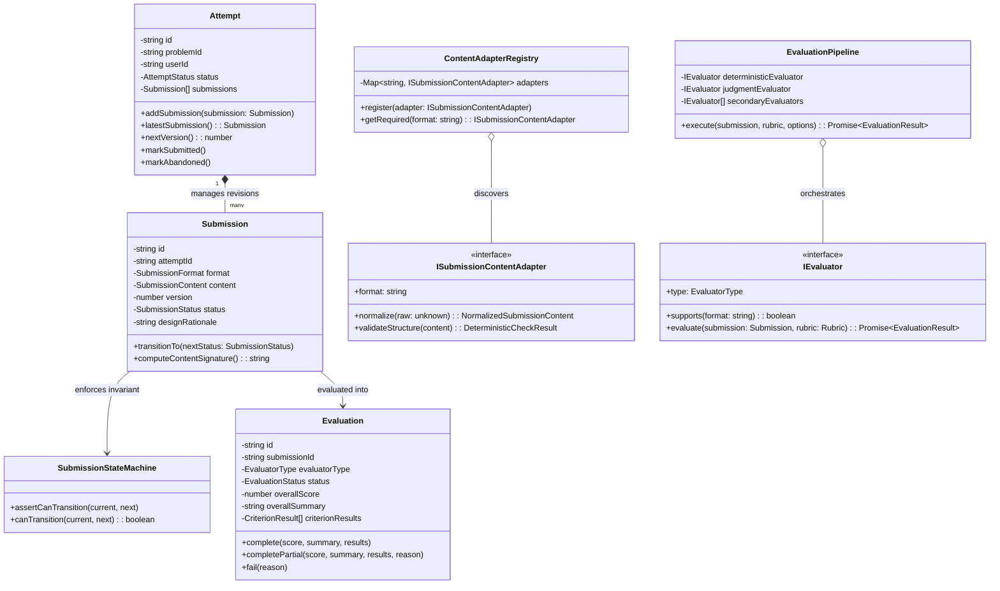

# Low-Level Design Practice Platform - Design Note

## 1. Executive Summary & MVP Scope

The **LLD Practice Platform** is a focused engineering practice tool built around the iterative learner cycle:
$$\text{Choose Problem} \longrightarrow \text{Design \& Formulate Rationale} \longrightarrow \text{Submit} \longrightarrow \text{Receive Evidence-Backed Feedback} \longrightarrow \text{Review Version Delta} \longrightarrow \text{Refactor}$$

### Scope Boundaries:
- **In Scope**:
  - Problem catalog with specifications, functional/non-functional requirements, constraints, and rubric criteria.
  - Multi-format practice workspace supporting structured Text Design, Code Implementations, and Class Diagrams with mandatory Design Rationale.
  - Asynchronous background evaluation queue (Redis + BullMQ) with state machine transition guards.
  - Pluggable evaluation architecture (`EvaluatorStrategy`):
    - Primary: **Autonomous Rule-Based Static Analysis Engine** (100% free, offline, instant $<20$ms execution, zero rate limits).
    - Cloud: **OpenRouter / Cloud LLM Adapter** with deep reasoning and candidate model failovers.
    - Testing: **Mock Evaluator** for fast, deterministic unit and integration test suites.
  - Version-to-version comparison tracking improvement/regression deltas across iterations.
  - Cross-attempt analytics highlighting recurring architectural weaknesses with targeted guidance.
- **Out of Scope**:
  - Complex distributed microservices, multi-region database sharding, or LMS enterprise features. A clean, modular monolith with distinct domain boundaries was purposefully selected.

---

## 2. Core Domain Model & Class Responsibilities



### Responsibility Breakdown:
- **`Attempt` (Aggregate Root)**: Owns the practice session lifecycle and encapsulates the collection of iterative submissions. Enforces sequential version numbering ($v1 \to v2 \to v3$) and ensures closed/abandoned attempts cannot accept new revisions.
- **`Submission` (Domain Entity)**: Represents a single solution snapshot. Encapsulates mandatory design rationale validation, legal lifecycle transitions (`PENDING` $\to$ `EVALUATING` $\to$ `COMPLETED`), and content fingerprinting for idempotency.
- **`SubmissionStateMachine` (Domain Service)**: Explicit state transition table guaranteeing illegal jumps (e.g. `PENDING` $\to$ `COMPLETED` skipping `EVALUATING`) are structurally impossible.
- **`ContentAdapterRegistry` (Adapter & Registry Pattern)**: Normalizes diverse raw payloads (Text, Code, Diagrams) into standard structural tokens, word counts, and section tallies without polluting evaluators.
- **`EvaluationPipeline` (Pipeline Pattern)**: Coordinates fail-fast deterministic heuristics, secondary rule-based checks, and AI evaluation with automated graceful degradation.
- **`WeightedScoreCalculator` (Domain Service)**: Computes normalized weighted scores ($0.0 - 5.0$) against rubric weights and computes version comparison deltas with significance thresholds ($|\Delta| \ge 0.2$).

---

## 3. The Two Change Tests

### Change Test A: Submission Format Extensibility
> *Question: Today the learner submits text. Later the platform supports a class diagram. How much of your domain model changes?*

- **Result**: **0 changes to core domain logic, evaluators, or practice workflows.**
- **Implementation**:
  1. Implement `DiagramSubmissionAdapter` conforming to `ISubmissionContentAdapter`.
  2. Register the adapter in `ContentAdapterRegistry` (e.g., `registry.register(new DiagramSubmissionAdapter())`).
  3. `DeterministicEvaluator` and `RuleBasedEvaluator` / `LlmEvaluator` consume the adapter polymorphically via `registry.getRequired(submission.format)`.
  4. Verified via automated test in [`change-tests.spec.ts`](file:///e:/Assignment_Projects/lld-practice-platform-v1/server/test/domain/change-tests.spec.ts).

### Change Test B: Evaluator Strategy Extensibility
> *Question: Today feedback comes from one evaluator. Later you add a rule-based evaluator or human review. Can you add it without rewriting the practice flow?*

- **Result**: **0 changes to queue processors, state machines, or controllers.**
- **Implementation**:
  1. Implement `RuleBasedEvaluator` (or `HumanReviewEvaluator`) conforming to `IEvaluator`.
  2. Plug it into `EvaluationPipeline` via `pipeline.addEvaluator(ruleBasedEvaluator)`.
  3. `EvaluationProcessor` delegates strictly to `pipeline.execute(...)` without knowing which concrete evaluators are active.
  4. Verified via automated test in [`change-tests.spec.ts`](file:///e:/Assignment_Projects/lld-practice-platform-v1/server/test/domain/change-tests.spec.ts).

---

## 4. Evaluation Approach: Deterministic vs. Architectural Judgment Separation

To maintain speed, zero operational downtime, and high reliability, evaluation is separated into two complementary phases:

```
Raw Submission ──► [ Phase 1: Fast Deterministic Pre-Flight ]
                         │
                         ├── Structural completeness check
                         ├── Word count & section detection
                         ├── Idempotency deduplication check
                         └── Mandatory rationale length validation
                         │
                         ▼
                   [ Phase 2: Architectural Judgment Engine ]
                         │
                         ├── Pluggable Strategy (RuleBasedEvaluator / LLM / Mock)
                         ├── Assesses SRP, coupling, cohesion, extensibility
                         ├── Formulates concrete suggestions
                         └── Extracts quoted EVIDENCE from candidate design
                         │
                         ▼
                   [ Phase 3: Resilience & Graceful Degradation ]
                         │
                         ├── If external API returns 429/503: fallback cascade
                         └── On retry exhaustion: fallback to COMPLETED_PARTIAL
```

### The 8-Criterion Canonical Rubric:
1. `REQUIREMENT_UNDERSTANDING`: Functional & scope coverage.
2. `CLASS_RESPONSIBILITIES`: Adherence to Single Responsibility Principle (SRP).
3. `COUPLING_COHESION`: Dependency injection, loose coupling, tight domain cohesion.
4. `ENCAPSULATION_INTERFACE_DESIGN`: Information hiding and interface contracts.
5. `EXTENSIBILITY`: Open-Closed Principle and pattern resilience.
6. `ABSTRACTION_AND_PATTERNS`: Purposeful use of GoF patterns (State, Strategy, Factory, Observer).
7. `EDGE_CASES_TESTABILITY`: Concurrency handling, null/overflow safety, test doubles.
8. `EXPLANATION_QUALITY`: Depth and clarity of design trade-off rationale.

Each criterion produces a structured result:
$$\text{CriterionResult} = \{\text{criterionId}, \text{score}, \text{evidence}, \text{concern}, \text{suggestion}, \text{confidence}\}$$

---

## 5. Scoring Formula & Version Delta Mathematics

### Overall Weighted Score Formula
The platform computes a normalized weighted average across all applicable criteria:

$$S_{\text{overall}} = \sum_{i=1}^{n} \left( \text{score}_i \times \frac{w_i}{\sum_{k=1}^{n} w_k} \right)$$

- Where:
  - $\text{score}_i \in [0.0, 5.0]$ is the raw criterion score.
  - $w_i > 0$ is the configured weight of criterion $i$.
  - The denominator $\sum_{k=1}^{n} w_k$ normalizes applicable weights to $1.0$.
  - $S_{\text{overall}}$ is rounded to 1 decimal place.

### Version Comparison Delta Formula
When comparing revision $v$ against preceding revision $v-1$:

$$\Delta_i = \text{score}_i^{(v)} - \text{score}_i^{(v-1)}$$

$$\text{DeltaClassification}(\Delta_i) = \begin{cases} 
\text{IMPROVED} & \text{if } \Delta_i \ge +0.2 \\
\text{REGRESSED} & \text{if } \Delta_i \le -0.2 \\
\text{SAME} & \text{if } -0.2 < \Delta_i < +0.2 
\end{cases}$$

The $0.2$-point significance threshold prevents noisy micro-fluctuations from misleading the learner.

---

## 6. Reliability, Concurrency & Idempotency

1. **Storage-First Ingestion**:
   Submissions are persisted to MySQL with status `PENDING` *before* enqueuing into BullMQ/Redis. If Redis crashes or workers restart, no learner work is lost.
2. **Deterministic Idempotency Guard**:
   To prevent duplicate jobs from accidental double-clicks, `Submission.computeContentSignature()` computes a SHA-256 fingerprint:
   $$\text{Hash} = \text{SHA-256}(\text{attemptId} + \text{format} + \text{JSON}(\text{content}) + \text{rationale})$$
   If a matching signature is currently `PENDING` or `EVALUATING` (or created within 10 seconds), the system returns the existing submission without duplicating work.
3. **Queue Idempotency**:
   BullMQ jobs are keyed by `jobId = submission.id`. Re-enqueuing the same submission cannot trigger duplicate concurrent worker runs.
4. **Duplicate In-Progress Attempt Guard**:
   Learners cannot start two concurrent `IN_PROGRESS` attempts on the same problem. The system intercepts this via `AttemptsService` and returns an HTTP `409 Conflict` containing the `existingAttemptId`, seamlessly resuming their active session.

---

## 7. Key Architectural Trade-Offs

| Decision | Chosen Approach | Alternative Considered | Rationale |
| :--- | :--- | :--- | :--- |
| **System Architecture** | Modular Monolith (NestJS + Next.js) | Microservices (API Gateway + Auth + Evaluator service) | The assignment explicitly warns against premature HLD bloat. A modular monolith provides sub-millisecond in-process boundary checks while preserving clean domain segregation. |
| **Evaluation Engine** | Pluggable `EvaluatorStrategy` with Autonomous `RuleBasedEvaluator` as default | Sole dependency on external cloud LLM APIs | Cloud LLMs on free tiers suffer from strict rate limits (`429 Too Many Requests`), latency spikes (15-30s), and network flakiness. Our Rule-Based Analyzer executes in $<20$ms, costs \$0, operates 100% offline, and directly satisfies **Change Test B**. Cloud LLMs remain pluggable when desired. |
| **Evaluation Timing** | Asynchronous polling via BullMQ | Synchronous HTTP blocking | Architectural reasoning takes several seconds. Blocking HTTP requests creates client timeouts, degrades server thread pools, and loses submissions on network drops. |
| **Submission Model** | Multi-Section Structured Form + Mandatory Rationale | Free-form single Markdown textarea | Single textareas invite rambling descriptions without class boundaries. Structured sections force learners to isolate requirements, classes, patterns, and trade-offs. |
| **Client Synchronization** | Short-interval HTTP Polling (1.5s) | WebSockets / Server-Sent Events (SSE) | Stateless HTTP polling eliminates sticky connection overhead, heartbeat ping-pong, and proxy reconnection bugs, while keeping prototype infrastructure simple and resilient. |

---

## 8. Direct Answers to Core Assignment Questions

### Q1: What does a learner actually need to provide for an LLD practice attempt to be meaningful?
> **Answer**: A meaningful attempt requires: (1) Core domain entities and interface definitions; (2) Responsibility assignments (SRP); (3) Design patterns applied to isolate change; and (4) A mandatory **Design Rationale** (2–5 sentences) articulating *why* specific trade-offs were made (e.g. why Strategy over State, or fine-grained locks over synchronized methods). Without the rationale, it is impossible to evaluate whether a design choice was deliberate or accidental.

### Q2: What makes feedback useful when there can be more than one valid LLD solution?
> **Answer**: Feedback is useful only when it evaluates **principles, not identity**. Rather than checking if the candidate's classes match a single "reference solution", our platform evaluates against an **invariant 8-criterion rubric** and extracts **quoted evidence** directly from the candidate's submission. Even if Solution A uses the State pattern and Solution B uses Strategy + Enums, both receive high marks if they cleanly decouple state transitions and encapsulate business logic.

### Q3: Which parts of evaluation should be deterministic, and which parts benefit from architectural judgment / heuristics?
> **Answer**: 
> - **Deterministic**: Structural presence of sections, required fields, token density, syntax validity, idempotency deduplication, and state machine transitions.
> - **Judgment / Heuristic Engine**: Single Responsibility boundary analysis, coupling/cohesion, appropriateness of patterns, extensibility under requirement drift, and the logical consistency of design trade-offs.

### Q4: How would your design accommodate another evaluation approach or another submission format later?
> **Answer**: 
> - **New format (Change Test A)**: Implemented via the **Adapter Pattern** (`ISubmissionContentAdapter`) and registered in `ContentAdapterRegistry`. Adding class diagrams (Mermaid/PlantUML) required zero changes to evaluators or queue processors.
> - **New evaluator (Change Test B)**: Implemented via the **Strategy Pattern** (`IEvaluator`) and registered in `EvaluationPipeline`. Adding `RuleBasedEvaluator` or human review required zero changes to controllers, queues, or state machines.

### Q5: What should happen if evaluation takes time or fails?
> **Answer**: 
> 1. Storage-first ingestion persists the submission as `PENDING` before enqueuing.
> 2. BullMQ executes with exponential backoff retries.
> 3. If retries are exhausted, the system initiates **Graceful Degradation** to `COMPLETED_PARTIAL`, returning deterministic pre-flight critique with an in-UI banner and a dedicated "Retry Evaluation" CTA. Learner work is never lost.
